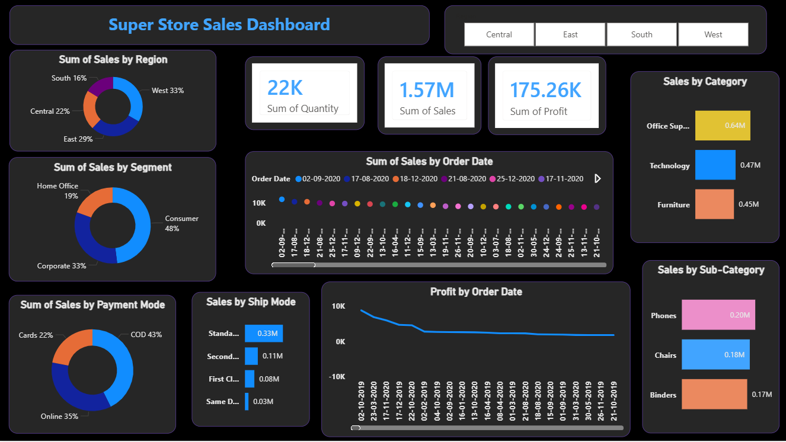

# 🛒 Super Store Sales Dashboard  

---

## 📌 Overview  

An interactive **Power BI dashboard** built to analyze retail store performance across multiple dimensions like **sales, profit, customers, and regions**.  

---

## 🎯 Business Problem  

Retail businesses generate large amounts of data but struggle to:  
- Track performance across regions  
- Identify profitable categories  
- Understand customer behavior  
- Monitor sales trends over time  

This dashboard solves these problems using clear and interactive visuals.  

---

## 🖥️ Dashboard Preview  

---

## 🚀 Features  

- Interactive filters (Region & Date)  
- Sales by Region analysis  
- Sales by Segment (Consumer, Corporate, Home Office)  
- Category & Sub-category insights  
- Payment Mode analysis (COD, Online, Cards)  
- Shipping Mode analysis  
- Sales trend over time  
- Profit trend analysis  

---

## 📊 Key Insights  

- West region contributes highest sales (~33%)  
- Consumer segment dominates (~48%)  
- COD is the most used payment mode (~43%)  
- Office Supplies is the top category  
- Phones generate highest revenue in sub-category  
- Profit shows fluctuation over time  

---

## 📈 KPIs  

- Total Sales: **1.57M**  
- Total Profit: **175.26K**  
- Total Quantity: **22K**  

---

## 🛠️ Tools & Technologies  

- Power BI  
- Excel / CSV Dataset  
- Data Cleaning  
- DAX (Data Analysis Expressions)  

---

## 📂 Dataset  

The dataset contains:  
- Order Date  
- Region  
- Segment  
- Category & Sub-category  
- Sales, Profit, Quantity  
- Payment Mode  
- Ship Mode  

---

## 🎯 Purpose  

- Practice Data Visualization  
- Build Data Analyst Portfolio  
- Extract insights from raw data  
- Showcase Power BI skills  

---

## 📌 How to Use  

1. Download the `.pbix` file  
2. Open in Power BI Desktop  
3. Use filters to explore insights  

---

## 🙋‍♂️ Author  

**Ayush Parashar**  
B.Tech Graduate | Aspiring Data Analyst  

Skills: Python, SQL, Power BI, Machine Learning  
